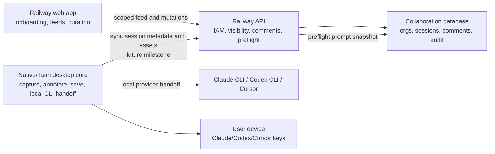

# Dbugr Phase Roadmap And Architecture

## Purpose

This document defines the recommended product scope for Dbugr's first three phases.

## Build Rule

Preserve the current desktop capture, annotation, session-save, and provider-handoff core unless a bug or reliability issue requires a change.

For the initial release scope, most new work should happen around:

- onboarding
- desktop-to-web account linking
- organization and team management
- review feeds
- comments and curation
- AI summary preflight
- submission review and history

The desktop app should evolve by adding hooks into these workflows, not by repeatedly redesigning or destabilizing the capture engine that already works.

The current decision is:

- Phase 1 and Phase 2 should ship as the initial product scope.
- Phase 3 should extend the same product into an enterprise-ready offering.

The architecture should make that extension straightforward. We should not need to rebuild the collaboration model, submission model, or permission model to support larger companies later.

## Product Positioning

### Initial target users

- Hackers
- College students
- Solo builders
- YC founders and startup teams
- Series A through D product, design, and engineering teams

### Enterprise-readiness goal

The initial product should still be credible to F100 design, product, and engineering teams evaluating an internal pilot.

That means:

- local-first credentials by default
- minimal PII on Dbugr servers
- clear org and role boundaries
- explicit visibility controls
- immutable prompt and submission history
- architecture that can later support customer-controlled storage and enterprise auth

## Scope Summary

### Initial scope = Phase 1 + Phase 2

The initial release should include both:

- the best solo capture-to-AI workflow on macOS
- lightweight social collaboration and curation on the web

This is the smallest scope that can still create viral and team-level adoption:

- solo users can use it immediately
- startup teams can collaborate around sessions
- public sharing can drive community discovery

### Phase 3 = enterprise-ready extension

Phase 3 should not change the core product. It should harden and extend the same workflows for larger organizations with stronger requirements.

Phase 3 should add:

- stronger IAM and admin controls
- enterprise auth options
- customer-controlled credential and data options
- deployment and compliance flexibility

## Initial Release Scope

The initial release should include the following end-to-end journey.

Important scoping rule:

- Keep the current desktop capture and handoff engine stable.
- Build most initial-scope expansion around the web collaboration layer and a few carefully chosen desktop integration points.

### 1. Local capture and annotation on macOS

Required:

- capture visible screen content reliably
- capture full screen or a chosen window when needed
- annotate with pins and regions
- add annotation-level notes
- add a single session-level note
- attach repo or local folder context
- save to a new or existing session

Why it matters:

- this is the core habit-forming action
- if this feels unreliable or slow, the social layer will not matter

### 2. Direct AI handoff

Required:

- submit to `Claude CLI`
- submit to `Codex CLI`
- submit to `Cursor`
- show a prompt preview before send
- preserve screenshots, notes, and accepted context
- show submission confirmation and next actions

Why it matters:

- the fastest user value is "I captured the problem and immediately handed the full context to my AI tool"

### 3. Account linking and lightweight auth

Required:

- web sign-in
- desktop-to-web account linking
- user profile
- organization creation
- invite teammates

Why it matters:

- collaboration requires identity
- we should keep the desktop app local-first, but it still needs an account bridge for review and feed workflows

### 4. Session visibility and collaboration

Required:

- `Private` sessions
- `Organization` sessions
- `Public` sessions
- one collaboration website with scoped feeds
- internal review visible only to organization members
- public feed visible on the same website

Why it matters:

- one feed system is simpler than separate products
- the same review object model should power private, team, and public feedback

### 5. Comments and curation

Required:

- session-level comments
- capture-level comments
- annotation-specific comments
- accept / reject / edit / duplicate / needs clarification
- owner-controlled curation board
- only accepted items enter the final AI payload

Why it matters:

- this turns Dbugr into a real collaboration product rather than a screenshot dropbox

### 6. AI summary preflight

Required:

- generate a structured summary from the selected provider route
- group accepted feedback by theme
- identify conflicts or ambiguity
- produce a clear bulleted final prompt
- let the owner edit or approve before final submission

Why it matters:

- this is the layer that keeps Claude/Codex from missing key asks
- it turns collaborative noise into a clean, actionable request

### 7. Minimal IAM and organization policy

Required:

- organizations
- optional teams
- roles
- invites
- permissions
- organization policies for public sharing and credential usage
- audit events for sensitive actions

Why it matters:

- startup teams need basic control immediately
- enterprise pilots need a plausible permission model from day one

### 8. Minimal public-community loop

Required:

- publish a session publicly with explicit confirmation
- require redaction confirmation before publish
- allow public comments
- keep poster approval in control of final AI payload inclusion
- allow owners to curate public suggestions before AI submission

Why it matters:

- public sharing creates discovery and adoption
- it also creates the "social proof" loop that can help Dbugr spread

## What Should Not Be In The Initial Release

Do not include these in the first combined Phase 1 + 2 scope:

- SAML / SCIM
- dedicated single-tenant deployment
- customer-managed keys
- full DLP scanning
- legal hold workflows
- region-specific storage controls
- advanced billing and seat management
- complex external admin portals
- deep browser extension work for tab-level capture

These are Phase 3 or later concerns.

## Recommended Phase Breakdown

### Phase 1: Solo Core

Ship the product so a single user can:

- install locally
- capture and annotate
- save sessions
- attach repo/folder context
- submit to Claude CLI, Codex CLI, or Cursor
- review prompt preview
- revisit prior sessions

Exit criteria:

- capture flow is stable and fast
- session persistence is reliable
- AI handoff works repeatedly
- install and run instructions are clean enough for GitHub-driven adoption

Milestone checklist:

- [x] Stable macOS capture flow
- [x] Stable annotation and session-save flow
- [x] Stable session history and reopen flow
- [x] Stable Claude CLI handoff
- [x] Stable Codex CLI handoff
- [x] Stable Cursor handoff
- [x] Prompt preview before submission
- [x] Repo / local-folder context attached to session
- [x] Local-first persistence for screenshots and notes
- [x] Clear local install and run documentation
- [x] Native migration direction documented without disrupting the current stable desktop flow

Quality-gated status as of 2026-05-03:

- [x] Unit/regression suite passed: `apps/desktop` `pnpm test` returned 74 passing tests.
- [x] Functional browser suite passed: `apps/desktop` `pnpm test:e2e` returned 30 passing Playwright tests.
- [x] Production desktop web build passed: `apps/desktop` `pnpm vite build`.
- [x] Annotation save/reopen verification includes screenshot payload rendering, append-to-existing-session behavior, delete behavior, no proactive session-board open after save, and local persistence checks.
- [x] Prompt preview verification includes a required pre-handoff payload review that displays session note, repo/folder context, annotations, provider target, and saved screenshot path references before Send is enabled.
- [x] Provider handoff verification includes Claude CLI Terminal launch, Codex CLI Terminal launch with local OpenAI key, Cursor app open/copy flow, and saved screenshot path references in the prompt payload.
- [x] Local setup documentation verification passed: `pnpm db:setup` completed successfully with normal IPC permissions after sandbox-only `tsx` pipe restrictions were ruled out.
- [x] Native migration isolation verification passed: `apps/desktop-native-mac` `swift build` completed successfully without touching the current Tauri desktop app.
- [x] Native macOS capture smoke passed: `apps/desktop-native-mac` `swift run debugr-native-mac --capture-smoke` captured a valid `1728x1117` display PNG with `transparent=0.00` and no validation issues.
- [x] Phase 1 capture gate now points to the native Swift/AppKit smoke path because native capture is the intended macOS architecture and it validates real ScreenCaptureKit output instead of Playwright mocks.
- [x] Current Tauri shell CoreGraphics smoke is deprecated legacy diagnostic coverage, not a Phase 1 gate. `apps/desktop/src-tauri` `env DEBUGR_CAPTURE_SMOKE=1 cargo run` may still fail with `CoreGraphics did not return a display image`; that failure is tracked as legacy-shell debt while the app moves to Swift/AppKit capture.

Quality tracker:

| Milestone | Logging | Unit / component tests | Regression tests | Functional verification | Quality gate |
| --- | --- | --- | --- | --- | --- |
| Stable macOS capture flow | Native Swift/AppKit must log capture start, selected source, permission state, image byte size, image dimensions, blank-frame validation result, save path, and failure reason. Logs must not include screenshot pixels. The old Tauri CoreGraphics smoke is legacy diagnostic-only. | Native capture validation covers non-zero dimensions, PNG encoding, transparent/blank sample checks, source filtering, and capture metadata normalization. | Re-run `apps/desktop-native-mac` `swift run debugr-native-mac --capture-smoke` for the real desktop. Keep Tauri Playwright capture tests as UI-flow coverage only, not proof of macOS capture. | Native smoke captured the visible desktop and saved PNG/JSON artifacts. The saved PNG was visually inspected and matched the actual screen. | Native capture must reject blank screenshots, preserve debug artifacts, and avoid relying on the Tauri/WebView overlay lifecycle as the long-term capture gate. |
| Stable annotation and session-save flow | Log annotation draft creation, note edit, tool mode, region geometry, target session id, existing annotation count, new annotation count, save start, save success, and save failure. | Add unit coverage for annotation count limits, region geometry serialization, session-note validation, append-to-existing-session behavior, and screenshot payload references. | Re-run regressions for adding to a new session, appending to an existing session, rejecting more than 5 annotations, deleting annotations, and showing the saved confirmation. | Create a session with multiple captures and notes. Append to it from the floating toolbar. Confirm the saved-state overlay names the target session and offers `Open session board`, `Add more`, and `Close`. | Saved annotations must include the actual screenshot reference, confirmation must be visible, and the main session window must not open unless the user asks. |
| Stable session history and reopen flow | Log session load start, source of session list, selected session id, loading threshold state, hydrate duration, screenshot thumbnail load result, and stale-cache fallback. | Add unit coverage for session sorting, empty-state selection, thumbnail URL resolution, persisted screenshot loading, and legacy session fallback fields. | Re-run regressions for empty history, one saved session, multiple saved sessions, deleting sessions, reopening sessions, and refreshing sessions. | Start with a clean database, save a session, restart the app, reopen it, and confirm the same screenshots, notes, and status are present. | No indefinite loading state, no broken thumbnail for a valid screenshot, and no unexpected app resize or focus jump during session open. |
| Stable Claude CLI handoff | Log provider target, credential mode, prompt build start, screenshot reference count, final prompt character count, Terminal launch result, command exit state when available, and user-facing confirmation. | Add unit coverage for Claude prompt building, screenshot path inclusion, accepted-context inclusion, provider label copy, and missing credential messaging. | Re-run regressions for connected Claude CLI, missing Claude CLI, missing project folder, multiple screenshots, and prompt preview approval. | Send a session with multiple annotations to Claude CLI and confirm Terminal opens with the expected command and payload references. | Claude flow must preserve multiple screenshots and notes, show clear `Claude CLI` wording, and never imply Claude Desktop injection. |
| Stable Codex CLI handoff | Log provider target, credential mode, prompt build start, screenshot reference count, final prompt character count, Terminal launch result, command exit state when available, and user-facing confirmation. | Add unit coverage for Codex prompt building, screenshot path inclusion, accepted-context inclusion, provider label copy, and missing CLI messaging. | Re-run regressions for connected Codex CLI, missing Codex CLI, missing project folder, multiple screenshots, and prompt preview approval. | Send a session with multiple annotations to Codex CLI and confirm Terminal opens with the expected command and payload references. | Codex flow must preserve multiple screenshots and notes, show clear `Codex CLI` wording, and avoid changing Claude or Cursor behavior. |
| Stable Cursor handoff | Log provider target, installed-app detection result, prompt copy result, app-open result, screenshot reference count, and user-facing confirmation. | Add unit coverage for Cursor prompt building, clipboard copy fallback, app detection messaging, and provider label copy. | Re-run regressions for Cursor installed, Cursor missing, clipboard failure, multiple screenshots, and prompt preview approval. | Submit to Cursor and confirm the app opens or the fallback guidance appears, with the full prompt copied. | Cursor flow must be honest about paste behavior and must not claim automatic image attachment if only text was copied. |
| Prompt preview before submission | Log preview generation start, included capture count, included annotation count, included accepted contribution count, prompt character count, edit state, approval action, and cancel action. | Add unit coverage for prompt section ordering, required fields, empty-session handling, accepted-only filtering, and provider-specific wording. | Re-run regressions for direct submit, edited prompt, canceled prompt, no annotations, and multiple captures. | Review a prompt before sending and confirm screenshots, notes, repo/folder context, and provider target are clearly visible. | User must be able to understand exactly what will be sent before any provider handoff starts. |
| Repo / local-folder context attached to session | Log folder selection, GitHub repo selection, context validation result, path normalization, permission failure, and context included in prompt. | Add unit coverage for local path normalization, GitHub URL parsing, missing context warnings, and prompt inclusion rules. | Re-run regressions for local folder, GitHub URL, no context, invalid path, and changed context after session save. | Create a session with a local folder and another with a GitHub repo. Confirm the final prompt includes the right context. | Context must be visible in session details and final prompt, and missing context must be explained without blocking unrelated saves. |
| Local-first persistence for screenshots and notes | Log asset write start, asset write success, metadata write success, storage path, asset byte size, migration/fallback path, and read failure reason. | Add unit coverage for asset path creation, session serialization, screenshot data URL loading, legacy migration fallback, and corrupt asset handling. | Re-run regressions for app restart, deleted asset file, corrupt metadata, multiple captures, and local-only mode without API. | Save sessions offline, restart the app, and confirm notes and screenshot thumbnails still load. | Local data must survive app restart and must not require cloud sync to view saved sessions. |
| Clear local install and run documentation | Log not required. | Add docs checks where available for broken links and command snippets. | Re-run fresh-clone setup documentation on a clean machine or clean checkout when practical. | Follow README and local development guide from scratch and confirm the main app, API, worker, and web dashboard launch. | A technical GitHub user should be able to run the product locally without tribal knowledge. |
| Native migration direction documented without disrupting the current stable desktop flow | Log not required for docs-only work. | Add docs checks where available for broken links. | Re-read native migration docs after desktop changes to confirm they do not instruct a risky rewrite. | Confirm the native prototype still builds separately from the current Tauri desktop app when touched. | Native migration must stay isolated until it reaches parity and must not destabilize the stable current app. |

### Phase 2: Social Review

Add collaboration on top of the solo core:

- sign in and link desktop to web
- create org
- invite team members
- review sessions on web
- comment on sessions, captures, and annotations
- curate accepted feedback
- generate AI summary preflight
- submit curated payload
- optionally publish publicly

Exit criteria:

- internal review works for startup teams
- public sharing exists with basic controls
- accepted comments correctly shape the final AI prompt
- org-level visibility and roles work predictably

Milestone checklist:

- [ ] Web auth and desktop account linking `[partial: account-scoped preview and link API done; real Google OAuth and native redeem handler pending]`
- [x] User profile and organization creation
- [x] Team invites and lightweight roles
- [ ] Session sync between desktop and web
- [x] Visibility controls for `Private`, `Organization`, and `Public`
- [x] Internal review feed
- [x] Public feed on the same website
- [x] Session-level comments
- [ ] Capture-level comments
- [ ] Annotation-specific comments
- [x] Curation board with accept / reject / edit decisions
- [x] AI summary preflight
- [x] Final prompt approval before send
- [x] Submission history with frozen prompt snapshots
- [x] Basic org policy controls for public sharing and credential usage
- [x] Audit events for sensitive collaboration and submission actions

Implementation status as of 2026-05-03:

- [x] Phase 2 Prisma schema spine added for organizations, teams, memberships, invites, contributions, curation decisions, AI review summaries, provider credential metadata, submissions, and audit-friendly policy fields.
- [x] Phase 2 API scaffold added for onboarding, invite acceptance, bootstrap, desktop-link create/redeem, scoped feeds, contributions, curation, visibility changes, AI preflight summary creation, and submission snapshots.
- [x] Phase 2 web scaffold added for onboarding, invite acceptance, desktop linking, review feed, curation, preflight, and submission using the Dbugr design system.
- [x] Detailed Phase 2 API and web action logging added with token redaction rules.
- [x] Phase 2 API endpoint smoke script added for onboarding -> invite accept -> desktop link -> feed -> contribution -> curation -> preflight -> visibility -> submission verification.
- [x] Railway web/API deployment guide added for the Phase 2 collaboration layer.
- [ ] Real Google OAuth.
- [ ] Native desktop-to-web device-link handler `[partial: API/web contract and macOS URL scheme done]`.
- [ ] Real invite email delivery.
- [ ] Session sync from desktop local storage to web.
- [ ] Production public-feed redaction and moderation controls.
- [ ] Railway Postgres migration for public multi-user launch.

Current Phase 2 architecture scaffold:

Quality tracker:

| Milestone | Logging | Unit / component tests | Regression tests | Functional verification | Quality gate |
| --- | --- | --- | --- | --- | --- |
| Web auth and desktop account linking | Log auth start, callback received, device-link token issued, token redeemed, desktop linked, desktop unlinked, token expiry, and auth failure reason. Never log raw tokens. | Add unit coverage for token hashing, expiry, replay prevention, auth callback validation, and desktop-link state reducers. | Re-run regressions for first sign-in, expired link, wrong account, logout, relink, and offline desktop behavior. | Sign in on web, link desktop, restart desktop, and confirm linked identity persists without exposing secrets. | Desktop linking must be reversible, token-safe, and understandable to a first-time user. |
| User profile and organization creation | Log profile created, org created, owner membership created, onboarding step completion, and validation failures. | Add unit coverage for org slug generation, required fields, owner role assignment, duplicate org names, and profile validation. | Re-run regressions for new user onboarding, existing user return, skipped optional role/team, and duplicate org name. | Create a new account, name an org, skip optional fields, and confirm dashboard and desktop both show the correct org. | First-run onboarding must land the user in a usable workspace without requiring team setup. |
| Team invites and lightweight roles | Log invite created, email queued, invite accepted, invite revoked, membership role changed, and permission-denied events. Never log invite tokens. | Add unit coverage for invite token hashing, invite expiry, role assignment, permission checks, and revoked invite behavior. | Re-run regressions for owner invite, member invite, reviewer invite, expired invite, duplicate invite, and revoked invite. | Invite a teammate, accept the invite in another account, and confirm the teammate can view/comment only where allowed. | Roles must enforce access in API and UI, not only through hidden buttons. |
| Session sync between desktop and web | Log sync start, local session id, remote session id, conflict result, asset upload result, retry count, and sync failure reason. | Add unit coverage for payload mapping, conflict resolution, retry scheduling, asset reference normalization, and offline queue behavior. | Re-run regressions for local-only session, sync after login, duplicate sync attempt, failed upload retry, and web edit then desktop refresh. | Capture locally, link account, sync, open web review board, and confirm the session, screenshots, and notes match. | Sync must preserve local data and avoid duplicate sessions. |
| Visibility controls for `Private`, `Organization`, and `Public` | Log visibility change requested, actor role, policy check result, redaction confirmation, approval status, and visibility change success/failure. | Add unit coverage for visibility transitions, policy gates, permission checks, and public redaction requirement. | Re-run regressions for private to org, org to public, public blocked by org policy, public approval required, and revert to private. | Change visibility from private to org and public, then verify feed visibility from owner, teammate, and anonymous/public views. | Private content must never appear in org or public feed without explicit visibility change. |
| Internal review feed | Log feed query scope, actor org id, result count, pagination cursor, filter state, and permission denials. | Add unit coverage for feed query filters, pagination, org scoping, sorting, and empty states. | Re-run regressions for empty feed, multiple orgs, pagination, search/filter, and unauthorized access. | Create several org sessions and confirm only the right organization members see them. | Internal review must be scoped by organization and role on the server. |
| Public feed on the same website | Log public publish request, redaction confirmation, moderation/manual review state, public feed query, report action, and unpublish action. | Add unit coverage for public query filters, publish policy, report handling, unpublish rules, and sanitized public response shape. | Re-run regressions for publish, public view, report, unpublish, org-public-disabled, and public comment restrictions. | Publish a redaction-confirmed session and confirm it appears publicly without leaking private-only fields. | Public feed must not expose private/org-only data or raw secrets in payloads. |
| Session-level comments | Log comment create, edit, delete, author id, session id, visibility, and permission denial. Avoid logging full comment body in production logs. | Add unit coverage for comment validation, permissions, editing window if used, deletion rules, and notification event creation. | Re-run regressions for owner comment, teammate comment, public comment, edit, delete, and unauthorized comment. | Add comments from owner and teammate accounts, then verify ordering and visibility. | Comments must be visible in the right scope and must never automatically enter the AI payload. |
| Capture-level comments | Log comment create, capture target id, session id, visibility, and permission denial. Avoid logging full comment body in production logs. | Add unit coverage for capture target validation, permissions, missing capture handling, and deleted capture behavior. | Re-run regressions for comment on first capture, comment on second capture, deleted capture, and unauthorized capture comment. | Add comments to two different captures and confirm each stays attached to the correct screenshot. | Capture comments must remain attached to the correct capture across reloads and prompt generation. |
| Annotation-specific comments | Log comment create, annotation target id, session id, visibility, and permission denial. Avoid logging full comment body in production logs. | Add unit coverage for annotation target validation, permissions, missing annotation handling, and deleted annotation behavior. | Re-run regressions for comment on pin, comment on region, deleted annotation, and unauthorized annotation comment. | Comment directly on an annotation and confirm the thread appears when that annotation is selected. | Annotation comments must not drift to the wrong annotation after edits or reloads. |
| Curation board with accept / reject / edit decisions | Log curation decision create, decision type, actor id, contribution id, included-in-payload state, edit state, and undo/reopen action. Avoid logging full private text in production logs. | Add unit coverage for accepted-only filtering, edit-then-accept, duplicate handling, permission checks, and decision state transitions. | Re-run regressions for accept, reject, edit, duplicate, needs clarification, undo, and non-owner access. | Accept some comments, reject others, edit one suggestion, and confirm the final context includes only accepted/edited items. | Owner-controlled curation must be the only path for social feedback to enter final AI context. |
| AI summary preflight | Log preflight requested, provider target, accepted contribution count, capture count, summary generation status, retry count, and approval status. Avoid logging full prompt in production logs unless explicitly stored as submission artifact. | Add unit coverage for summary input shaping, accepted-only inclusion, conflict grouping, provider fallback, and empty feedback behavior. | Re-run regressions for no comments, many comments, conflicting comments, regenerated summary, edited summary, and provider failure. | Generate a preflight summary and confirm it creates clear bullets, conflicts, do-not-change notes, and screenshot references. | Preflight must make the final AI prompt clearer and must not include rejected feedback. |
| Final prompt approval before send | Log prompt preview opened, edited, approved, canceled, provider selected, and submission started. | Add unit coverage for prompt approval state, edited prompt persistence, provider selection, and cancel behavior. | Re-run regressions for approve, edit then approve, cancel, switch provider, and stale preflight summary. | Approve a final prompt and confirm no provider handoff starts before approval. | Final send must require explicit user approval after curated context is visible. |
| Submission history with frozen prompt snapshots | Log submission created, artifact references stored, provider target, credential scope, response received, and response linked to session. | Add unit coverage for immutable snapshot storage, screenshot reference storage, provider metadata, and response linking. | Re-run regressions for multiple submissions, edited prompt snapshots, deleted comments after submit, and response refresh. | Submit a curated session, then modify comments and confirm the old submission snapshot is unchanged. | Submission records must be reproducible and must not change after creation. |
| Basic org policy controls for public sharing and credential usage | Log policy read, policy update, actor role, policy check result, and denied action reason. | Add unit coverage for policy defaults, updates, permission checks, public sharing gate, and credential usage gate. | Re-run regressions for public sharing disabled, approval required, personal credentials disabled, and org credentials enabled. | Change org policies as owner and confirm member behavior changes immediately. | Policies must be enforced server-side and reflected clearly in UI. |
| Audit events for sensitive collaboration and submission actions | Log audit write success/failure for auth link, invite, role change, visibility change, public publish, curation decision, provider credential change, and AI submission. | Add unit coverage for audit event creation, actor/resource typing, sensitive field redaction, and query scoping. | Re-run regressions for each sensitive action and verify the audit event exists. | Perform a small end-to-end org review flow and confirm the audit timeline tells the story accurately. | Sensitive actions must produce audit events without storing raw secrets or unnecessary private content. |

### Phase 3: Enterprise-Ready

Extend the same product for larger organizations:

- enterprise auth and identity
- stronger audit and admin controls
- customer-controlled storage or deployment options
- stricter provider credential policies
- compliance and retention controls
- deployment flexibility

Exit criteria:

- a larger company can evaluate Dbugr without asking us to redesign the core data, permission, or submission model

Milestone checklist:

- [ ] Stronger org admin controls
- [ ] Enterprise auth path planned or implemented
- [ ] Organization-managed credential model hardened
- [ ] Customer-controlled storage / deployment path defined
- [ ] Retention and audit posture expanded
- [ ] Compliance-oriented policy layer extended without changing the core product model

Quality tracker:

| Milestone | Logging | Unit / component tests | Regression tests | Functional verification | Quality gate |
| --- | --- | --- | --- | --- | --- |
| Stronger org admin controls | Log admin action, actor role, target user/resource, policy result, and denial reason. | Add unit coverage for admin permissions, role boundaries, membership changes, and protected owner behavior. | Re-run regressions for owner/admin/member/reviewer/guest boundaries. | Verify admins can manage allowed resources and cannot cross protected boundaries. | Admin controls must be enforceable through API checks, not UI-only restrictions. |
| Enterprise auth path planned or implemented | Log SSO/OIDC configuration events, domain verification, login success/failure, and provisioning errors. Never log assertions or raw identity tokens. | Add unit coverage for identity mapping, domain rules, membership creation, and login callback validation. | Re-run regressions for password/social login coexistence, domain-based org routing, and logout. | Verify a test enterprise identity can access only the intended organization. | Enterprise auth must not weaken existing solo/startup auth flows. |
| Organization-managed credential model hardened | Log credential create/update/delete metadata, provider target, scope, policy check, and usage event. Never log raw credentials. | Add unit coverage for secret reference handling, permission checks, rotation metadata, disabled credential behavior, and provider usage policy. | Re-run regressions for personal credential use, org credential use, disabled personal credentials, and credential rotation. | Submit using an org credential path and confirm members never see the raw secret. | Credential model must support enterprise control without storing or returning raw secrets in app responses. |
| Customer-controlled storage / deployment path defined | Log storage adapter selection, write/read metadata, asset reference creation, and adapter failure. | Add unit coverage for storage interface contracts, signed URL creation, asset metadata normalization, and adapter error behavior. | Re-run regressions against local/dev storage plus at least one hosted storage adapter. | Switch storage adapter in a test environment and confirm session assets still load through the same app flow. | Storage ownership must be abstracted enough that enterprise-controlled storage can be added without rewriting session logic. |
| Retention and audit posture expanded | Log retention policy changes, deletion/export requests, audit export requests, and retention job results. | Add unit coverage for retention policy calculation, deletion eligibility, export scoping, and audit immutability. | Re-run regressions for retain, delete, export, and audit visibility rules. | Create data, apply a retention policy in test, and confirm only eligible data is affected. | Retention and audit behavior must be predictable and explainable to admins. |
| Compliance-oriented policy layer extended without changing the core product model | Log policy evaluation name, actor, resource, decision, and denial reason. | Add unit coverage for new policy gates, defaults, override behavior, and permission interaction. | Re-run regressions for every existing public sharing, credential, curation, and submission flow after adding a new policy. | Add one new enterprise policy in test and confirm existing startup flows still work with default settings. | Enterprise policy expansion must be additive and must not fork the core workflow. |

## Architecture Principles

To make Phase 2 extend cleanly into Phase 3, use these architecture rules from the beginning.

### 1. Local-first credentials

Default behavior:

- personal AI credentials stay on the user's device
- local CLI auth stays on the user's device
- Dbugr servers should not become a warehouse for personal provider secrets

Phase 3 extension:

- allow organization-managed credentials as an optional capability
- keep them scoped and abstracted behind a provider credential layer

### 2. Minimal PII by default

Store only what collaboration requires:

- email
- display name
- avatar, optional
- org membership
- session and contribution state

Avoid unnecessary personal profile collection.

Phase 3 extension:

- customer-controlled profile sources via enterprise auth

### 3. One collaboration model, three visibility scopes

Use one session and contribution model for:

- `Private`
- `Organization`
- `Public`

Do not build three separate products.

Phase 3 extension:

- add `Link-only`
- add stricter org policy controls
- add external guest workflows if needed

### 4. Separate control plane from data plane

Conceptually separate:

- identity, roles, policies, and workflow orchestration
- content storage, prompt storage, and collaboration data

This does not mean fully building enterprise deployment now. It means keeping service boundaries clean enough that we can later swap storage ownership models.

Phase 3 extension:

- customer-hosted or enterprise-controlled collaboration data plane

### 5. Treat submission as a frozen artifact

Every final AI submission should freeze:

- accepted context
- generated summary
- final edited prompt
- provider target
- screenshot references
- submission metadata

Why:

- this supports reproducibility
- this supports trust and auditing
- this makes enterprise extension much easier

### 6. Keep desktop and web responsibilities separate

Desktop should own:

- capture
- annotation
- local persistence
- local credential use
- fast save flow
- deep links into review and submit flows

Web should own:

- auth
- organizations
- invites
- feed visibility
- comments and curation
- prompt review
- public feed
- organization policy controls

Phase 3 extension:

- richer admin and audit surfaces in the web app

### 7. Build policy gates, not hardcoded assumptions

Examples:

- can this org publish publicly?
- does this org require approval before public posting?
- can this org use personal provider credentials?
- can this role submit to AI?

Represent these as policy and permission checks rather than scattered UI rules.

Phase 3 extension:

- new enterprise policies can be added without reshaping the product flow

## Recommended System Shape

### Desktop app

Responsibilities:

- capture and annotate
- store local screenshot assets
- create and update sessions
- use local provider integrations
- sync sessions to web account when linked
- open the web review board when collaboration is needed

### Web app

Responsibilities:

- sign in
- org and team management
- internal review feed
- public feed
- comments and curation
- final prompt preview
- AI summary preflight review
- submission history
- org policy settings

### API

Responsibilities:

- auth/session bridge
- session sync
- feed queries
- comments and curation mutations
- policy evaluation
- audit event storage
- final submission record storage

### Worker

Responsibilities:

- async summary generation
- notification fanout
- public-feed processing
- future moderation hooks

## Phase 3 Extension Map

These are the explicit seams we should preserve.

### Credentials

Initial:

- personal local credentials
- optional org-managed credentials modeled, possibly limited

Phase 3:

- stricter org-managed credential controls
- enterprise credential routing

### Identity

Initial:

- email/social login
- org invites
- roles

Phase 3:

- SSO / SCIM
- domain-based org enforcement

### Storage ownership

Initial:

- Dbugr-hosted collaboration data
- local-first personal credentials

Phase 3:

- customer-controlled storage or hosted enterprise deployment option

### Compliance

Initial:

- audit events
- immutable prompt snapshots
- redaction confirmation

Phase 3:

- retention controls
- stronger moderation and DLP
- legal/compliance policies

## Recommended Build Order

1. Preserve and lightly harden the existing desktop capture and AI handoff loop.
2. Add account linking and web auth.
3. Add organizations, invites, roles, and visibility scopes.
4. Add session sync and deep links between desktop and web.
5. Add internal review feed and comments.
6. Add curation board and accepted-comment payload building.
7. Add AI summary preflight and final prompt approval.
8. Add public feed with redaction confirmation and approval controls.
9. Add policy and audit hardening.
10. Add Phase 3 seams deliberately, without fully building enterprise features yet.

## Tracking Guidance

Use this roadmap file to track milestone completion at the phase level.

Use [docs/phase-2-social-refinement-plan.md](/Users/kumar/debugr/docs/phase-2-social-refinement-plan.md:1) to track the detailed implementation sequence for collaboration, IAM, curation, and submission work.

Rule of thumb:

- update this roadmap when a milestone is meaningfully complete
- update the detailed social refinement plan as sub-steps are implemented
- avoid copying low-level implementation tasks back into this roadmap unless they change phase scope or milestone status

## Final Recommendation

The best product shape is:

- **Initial scope:** Phase 1 + Phase 2 together
- **Market wedge:** solo-to-team capture and AI collaboration for hackers, students, YC startups, and growth-stage startup teams
- **Phase 3 path:** enterprise-ready extension without redoing the product model

This gives Dbugr:

- immediate individual value
- collaborative team value
- public growth loops
- a credible long-term story for larger companies

The key is not to build enterprise features too early. It is to build the initial product on clean seams that let enterprise requirements attach later.
